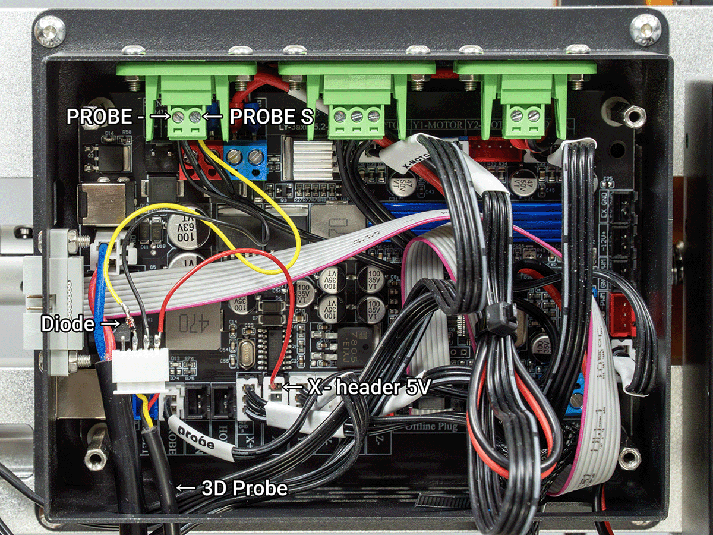
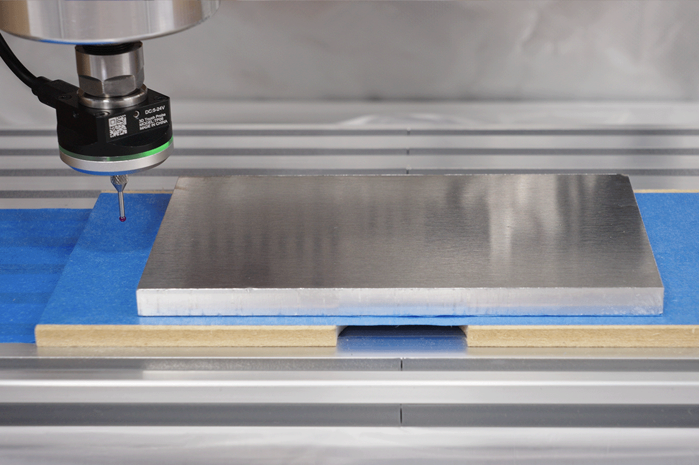

# GRBL 3D Touch Probe Macro for Stock Center Finding

This is a GRBL-compatible probing macro for finding the XY center of stock material using a 3D touch probe.

The macro is mainly intended for stock shapes where the XY center can be calculated by probing opposite sides in X and Y.  
It can be used with rectangular, square, circular, and similar stock shapes.

It probes opposite sides of the stock in the X direction, then opposite sides in the Y direction, calculates the center point, moves to that center position, and sets the current work coordinate XY origin to `X0 Y0`.

The probing logic uses standard GRBL-compatible commands such as `G38.2` and `G10 L20`.

This macro is not specific to any single sender software. It may be used with different GRBL control software such as gSender, CNCjs, or other GRBL senders, depending on how the software handles macros, variables, and expression syntax.

## Macro file

The macro itself is available here:

[`stock-center-probe.nc`](./stock-center-probe.nc)

## What this macro does

- Probes the opposite sides of the stock in X
- Calculates the X center
- Moves to the X center
- Probes the opposite sides of the stock in Y
- Calculates the Y center
- Moves to the Y center
- Sets the current XY position as `X0 Y0`

Because both opposite sides are probed, the probe tip radius is cancelled out when calculating the center.

No probe diameter compensation is required for center finding.

## Tested setup

This macro was created and tested on a GRBL-based desktop CNC setup.

Example setup:

- Machine: LUNYEE 3020 Nova
- Controller: GRBL-based controller
- Firmware: GRBL-compatible 1.1f
- Probe: 3-wire normally open (NO) 3D touch probe
- Diode: 1N5819 Schottky diode recommended, 1N4148 can also be used

## Compatibility note

The probing commands used in this macro are standard GRBL-compatible G-code commands.

However, the variable and expression syntax, such as:

```gcode
%stockX = 200
G0 Z[safeZ]
G38.2 X[search] F[fast]
```

depends on the macro parser of the sender software.

If your sender does not support this syntax, you may need to rewrite the macro using that software's own macro format, or manually replace the variables with fixed numeric values.

## Example parts used

This setup uses the following parts:

- 3D Touch Probe: https://s.click.aliexpress.com/e/_c32Wedvf
- 1N5819 Schottky Diode: https://s.click.aliexpress.com/e/_c40LwLeh
- 3-pin XH 2.54 mm Connector for the X- header: https://s.click.aliexpress.com/e/_c3S7zVKN
- Crimping Tool: https://s.click.aliexpress.com/e/_c2Ifr4Fj

These are affiliate links, used to allow AliExpress to redirect visitors to the most appropriate regional domain based on their location.

Please note that similar-looking probes, connectors, and controller boards may have different wiring, pinouts, voltage levels, connector pitch, or signal behavior. Always check your own parts and controller board with a multimeter before connecting anything.

## Probe wiring used in this setup



This is the wiring used to connect my 3D touch probe to the LUNYEE 3020 Nova.

The 3D probe has three wires:

- Red: 5V
- Black: GND
- Yellow: Probe signal

In this setup, the probe is powered from the X- limit switch header, and the probe signal is connected to the PROBE input through a diode.

A 1N5819 Schottky diode is recommended.  
A 1N4148 switching diode can also be used, but a 1N5819 Schottky diode is preferred because of its lower forward voltage.

```text
3D Probe                         3020 Nova

Red   -------------------------> X- header 5V

Black -------------------------> PROBE -

Yellow --- Cathode |<| Anode --> PROBE S
           1N5819 or 1N4148
```

In other words:

- Red wire: `X- header 5V`
- Black wire: `PROBE -`
- Yellow probe signal wire: diode cathode side, striped side
- `PROBE S`: diode anode side, non-striped side

With this wiring:

- When idle, the Yellow signal line is high, but it is blocked from feeding back into the PROBE S input
- When triggered, the Yellow signal line goes low and pulls PROBE S low through the diode

This helps prevent the 5V probe signal from being directly fed into the PROBE S input.

## Wiring notes

Before using this wiring, check your own controller board with a multimeter.

In this wiring, `PROBE -` must share a common ground with the X- header GND used to power the probe.

Do not assume that all 3020 Nova machines or GRBL controller boards have the same pinout or voltage levels.

Incorrect wiring may damage the controller board, the probe, or both.

Use this wiring at your own risk.

Also confirm that the probe input state is detected correctly by your sender software before running the macro.

If the probe state is inverted, check your GRBL `$6` setting and your probe wiring.

## Important starting position



Before running the macro:

1. Set the material top surface as `Z0` using a standard Z-probing function or similar feature in your GRBL sender software
2. Place the probe outside the left side of the stock
3. Position the probe roughly near the Y center of the stock
4. Make sure Z is at a safe height
5. Confirm that the probe is working correctly before running the macro

The macro assumes that the machine starts from outside the left side of the stock, near the Y center, at a safe Z height.

```text
Top view

                  Y+
                  ^
                  |
                  |

        +-------------------+
        |                   |
   o -> |       Stock       |
        |                   |
        +-------------------+

Probe start position:
outside the left side,
near the Y center of the stock

X- <---------------------------------> X+
```

## Example video

This macro is used in the following YouTube video:

- https://youtu.be/f7GCkKY4fKs?t=179

## Parameters

Edit these values in `stock-center-probe.nc` to match your stock and setup:

```gcode
%stockX = 200
%stockY = 100
%probeZ = -2.5
%safeZ = 10.0
%margin = 10.0
%search = 50.0
%fast = 150.0
%slow = 40.0
%retract = 2.0
```

## Parameter explanation

| Parameter | Description |
|---|---|
| `stockX` | Approximate stock size in the X direction, left to right in the top view |
| `stockY` | Approximate stock size in the Y direction, front to back in the top view |
| `probeZ` | Z height used for side probing |
| `safeZ` | Safe Z height for rapid moves |
| `margin` | Extra clearance used when moving around the stock |
| `search` | Maximum probing distance |
| `fast` | First probing feed rate |
| `slow` | Second, slower probing feed rate |
| `retract` | Retract distance after each probe touch |

`stockX` and `stockY` are mainly used for moving around the stock.

They are not used directly for the final center calculation.

For circular stock, `stockX` and `stockY` can be treated as the approximate diameter or the size of the bounding box around the stock.

Make sure these values are large enough so that the probe moves completely outside the opposite side of the stock before lowering Z again.

If the stock size is inaccurate or the margin is too small, the probe may still be above the material when Z moves down to the probing height.

## How the center calculation works

The macro measures the opposite sides of the stock in X:

```gcode
%xMinus = params.PRB.x
%xPlus = params.PRB.x
```

Then it calculates the X center:

```gcode
%centerX = (xMinus + xPlus) / 2
```

After probing the X+ side, the current position is `xPlus + retract`.

So the move back to the X center is:

```gcode
%xMoveToCenter = centerX - (xPlus + retract)
```

The same logic is used for the Y direction:

```gcode
%centerY = (yMinus + yPlus) / 2
%yMoveToCenter = centerY - (yPlus + retract)
```

Because both opposite sides are measured, the probe tip radius cancels out in the center calculation.

## Work coordinate setting

This macro uses:

```gcode
G10 L20 P0 X0 Y0
```

This sets the current work coordinate system so that the current position becomes `X0 Y0`.

If you always use G54 and want to set G54 explicitly, you can change this line:

```gcode
G10 L20 P0 X0 Y0
```

to:

```gcode
G10 L20 P1 X0 Y0
```

## Safety notes

Use this macro and wiring at your own risk.

Before running it on a real workpiece:

- Test the probe input first
- Confirm the probe wiring
- Confirm the probing direction
- Confirm that the starting position is correct
- Confirm that the probe can move completely outside the stock before lowering Z
- Run the macro slowly during the first test
- Be ready to stop the machine
- Make sure the stock size and margin values provide enough clearance

This macro was created and tested on a GRBL-based desktop CNC setup, but machine behavior may vary depending on the controller, firmware, sender software, macro parser, probe wiring, and probe input settings.

## Author

Created and tested by [cinetronix](https://www.youtube.com/@cinetronix_labs)

## License

This project is released under the MIT License.

Use this macro and wiring information at your own risk.

See the [LICENSE](./LICENSE) file for details.
